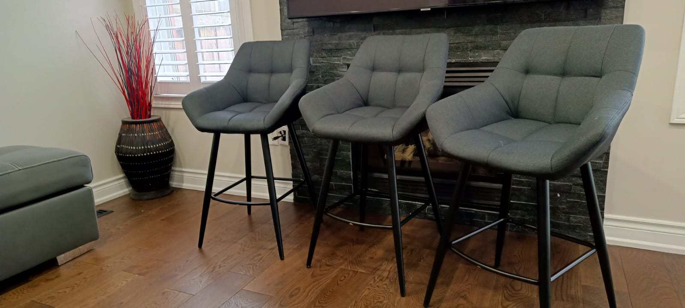

# Superstore-PostgreSQL



## Introduction

This is a project for a Super Store Organisation which sells office supplies, furnishings, maintenance and housekeeping equipment, items for public areas to various properties in different cities in the U.S.A. The project is to help the organisation understands how the business has performed over time.

The organisation provided data on the orders made, products available and the properties the organisation have sold to in the past.

## Data Sources

The primary dataset for the analysis is the "orders" dataset and the secondary datasets from "products" and "propertyInfo".

#### Data Dictionary

|Orders|Products|PropertyInfo|
|---|----|-----------|
|OrderID|ProductID|PropID|
|OrderDate|ProductName|PropertCity|
|PropertID|ProductCategory|PropertyState|
|ProductID|Price|
|Quantity|

### Tools
- Excel - For data cleaning (data loading and inspection)
- PostreSQL - for data analysis

## Exploratory Data Analysis (EDA)
EDA involves exploring the datasets to investigate the performance of the Supersotore over time, using queries provided by the organisation in PostgreSQL program (pgAdmin 4) like (Two queries were omitted and some were vague):

#### Question 1: Show all details about Properties, Orders and Products.

``` SQL
SELECT * FROM propertinfo;
SELECT * FROM orders;
SELECT * FROM products;
```
#### Question 2: Select the city and state column in propertyinfo Table

```SQL
SELECT "PropertyCity", "PropertyState"
FROM propertyinfo;
```
#### Question 3: We will like to know the dates orders were made and the quantity of orders made

```SQL
SELECT * FROM orders;

SELECT "OrderDate", "Quantity"
FROM orders;
```
#### Question 4: We will like to know unque dates orders were made

```SQL
SELECT DISTINCT ("OrderDate")
FROM orders;
```

#### Question 5: We want to know the different products category we have made orders

```SQL
SELECT * FROM products;

SELECT "ProductCategory"
FROM products;
```
For distinct products

```SQL
SELECT DISTINCT("ProductCategory")
FROM products;
```
#### Question 6: We want to know the different properties that we have made orders

```SQL
SELECT * FROM orders;

SELECT DISTINCT ("PropertyID")
FROM orders;
```
#### Question 7: Select the data from orders and sort in ascending order of quantity

```SQL
SELECT *
FROM orders
ORDER BY "Quantity" ASC;
```
#### Question 8: Select all products and their details and sort in descending order of price

```SQL
SELECT * FROM products;

SELECT *
FROM products
ORDER BY "Price" DESC;
```
#### Question 9: Find the five most expensive products

```SQL
SELECT *
FROM products
ORDER BY "Price" DESC
LIMIT 5;
```

#### Question 10: Find the five least expensive products

```SQL
SELECT *
FROM products
ORDER BY "Price" ASC
LIMIT 5;
```
#### Question 13: Select all properties in descending order of the city they are in

```SQL
SELECT * FROM propertyinfo;

SELECT *
FROM propertyinfo
ORDER BY "PropertyCity" DESC;
```

#### Question 14: Find the name of products whose id is 50

```SQL
SELECT * FROM products;

SELECT "ProductID", "ProductName"
FROM products
GROUP BY "ProductID"
HAVING "ProductID" = 50;
```
No need of GROUP BY
```SQL

SELECT "ProductID", "ProductName"
FROM products
WHERE "ProductID" = 50;
```

#### Question 15: Find the name and category of products whose id is 94

```SQL

SELECT * FROM products;

SELECT "ProductID", "ProductName", "ProductCategory"
FROM products
GROUP BY "ProductID"
HAVING "ProductID" = 94;
```
No need of GROUP BY and HAVING
```SQL
SELECT "ProductID", "ProductName", "ProductCategory"
FROM products
WHERE "ProductID" = 94;
```

#### Question 16: Find the name and category of products whose prices are above $200

```SQL
SELECT "ProductID", "ProductName", "ProductCategory", "Price"
FROM products
GROUP BY "ProductID"
HAVING "Price" > 200;
```
No need of GROUP BY and HAVING
```SQL
SELECT "ProductID", "ProductName", "ProductCategory", "Price"
FROM products
WHERE "Price" > 200;
```

#### Question 17: Find the name and category of the most expensive product
```SQL
SELECT "ProductID", "ProductName", "ProductCategory", "Price"
FROM products
GROUP BY "ProductID"
ORDER BY "Price" DESC
LIMIT 1;
```
Amend as
```SQL
SELECT "ProductID", "ProductName", "ProductCategory", "Price"
FROM products
ORDER BY "Price" DESC
LIMIT 1;

SELECT "ProductID", "ProductName", "ProductCategory", "Price"
FROM products
WHERE "Price" = (SELECT MAX("Price") FROM products);

SELECT "ProductID", "ProductName", "ProductCategory", "Price"
FROM products
WHERE "Price" > (SELECT AVG("Price") FROM products);

SELECT "ProductID", "ProductName", "ProductCategory", "Price"
FROM products
WHERE "Price" NOT BETWEEN 85 AND 200;
```

#### Question 18: Find the name and category of product whose price is $300
```SQL
SELECT *
FROM products
WHERE "Price" = 300;
```
Amend
```SQL
SELECT "ProductName", "ProductCategory"
FROM products
WHERE "Price" = 300;
```

#### Question 19: Find the name of product whose prices are between $50 and $200
```SQL
SELECT * FROM products;

SELECT "ProductName", "Price"
FROM products
WHERE "Price" BETWEEN 50 AND 200;
```

#### Question 20: Find the productid of product solid between 07-01-2015 and 10-01-2015
```SQL
SELECT * FROM orders;

SELECT "ProductID", "OrderDate"
FROM orders
WHERE "OrderDate" BETWEEN '2015-01-07' AND '2015-01-10';
```

#### Question 21: Find orders by property 14, 16, and 10
```SQL
SELECT * FROM orders;

SELECT "PropertyID", "OrderID"
FROM orders
WHERE "PropertyID" IN(14,16,10);
```

#### Question 22: Find orders by property not 14, 16, and 10

```SQL
SELECT "PropertyID", "OrderID"
FROM orders
WHERE "PropertyID" NOT IN(14,16,10);
```

#### Question 24: What product price is the lowest?

```SQL
SELECT "Price"
FROM products
GROUP BY "Price"
ORDER BY "Price" ASC
LIMIT 1;
```
Product name

```SQL
SELECT "ProductName", "Price"
FROM products
LIMIT 1;
```
#### Question 25: What product price is the highest?
```SQL
SELECT "ProductName", "Price"
FROM products
ORDER BY "Price" DESC
LIMIT 1;
```

#### Question 26: How many product there?
```SQL
SELECT COUNT ("ProductName")
FROM products;
```

#### Question 27: How many orders were made in total?
```SQL
SELECT * FROM orders;

SELECT SUM("Quantity")
FROM orders;
```

#### Question 28: What is the average price of products?
```SQL
SELECT * FROM products;

SELECT AVG ("Price")
FROM products;
```
or roundup to 2 decimal places
```SQL
SELECT round(AVG ("Price"), 2)
FROM products;
```
#### Question 29: What products have names starting with "T"?
```SQL
SELECT "ProductName"
FROM products
WHERE "ProductName" LIKE 'T%';
```
#### Question 30: We want to find the average price of housekeeping products.
```SQL
SELECT AVG("Price")
FROM Products
GROUP BY "ProductName";
```
#### Question 31: We will like to know the number of products available and the sum of their prices assuming there is just two of each product available in the store
```SQL
SELECT COUNT("ProductName")*2 AS "TotalProcuts", SUM("Price")*2 AS "TotalPrice"
FROM products;
```
#### Question 32: Display in a new Table each order and the amount paid for them.
orderID and price
```SQL
SELECT "OrderID", "Price"
FROM orders
JOIN products
ON orders."OrderID" = products."ProductID";
```
orderID, productName and price
```SQL

SELECT "OrderID", "ProductName", "Price"
FROM orders
JOIN products
ON orders."OrderID" = products."ProductID";
```
Distict productName, orderID and price
```SQL

SELECT DISTINCT ("ProductName"), "OrderID", "Price"
FROM orders
JOIN products
ON orders."OrderID" = products."ProductID";
```

Distinct productCategory, orderID and price

```SQL

SELECT DISTINCT ("ProductCategory"), "OrderID", "Price"
FROM orders
JOIN products
ON orders."OrderID" = products."ProductID";
```

Using LEFT JOINS

```SQL
SELECT *
FROM orders
LEFT JOIN products
ON orders."OrderID" = products."ProductID";
```
orderID and price

```SQL
SELECT "OrderID", "Price"
FROM orders
LEFT JOIN products
ON orders."OrderID" = products."ProductID"
ORDER BY "Price";
```
Using Right JOINS

```SQL
SELECT *
FROM orders
RIGHT JOIN products
ON orders."OrderID" = products."ProductID";
```
orderID and price
```SQL
SELECT "OrderID", "Price"
FROM orders
RIGHT JOIN products
ON orders."OrderID" = products."ProductID"
ORDER BY "Price";
```

#### Question 33: Find the first 10 products and their category soild on 01-01-2015.

```SQL
SELECT "ProductName", "ProductCategory"
FROM orders
JOIN products
ON orders."OrderID" = products."ProductID";
```
Above plus orderDate

```SQL

SELECT "OrderDate", "ProductName", "ProductCategory"
FROM orders
JOIN products
ON orders."OrderID" = products."ProductID";
```
Specific date
```SQL

SELECT "OrderDate", "ProductName", "ProductCategory"
FROM orders
JOIN products
ON orders."OrderID" = products."ProductID"
WHERE "OrderDate" = '2015-01-01'
LIMIT 10;
```

#### Question 34: What is the best selling product category in terms of quantity solid?

```SQL
SELECT "ProductCategory", "Quantity"
FROM orders
JOIN products
ON orders."OrderID" = products."ProductID";
```
Count Quantity and grouped by ProductCategory
```SQL
SELECT "ProductCategory", COUNT ("Quantity")
FROM orders
JOIN products
ON orders."OrderID" = products."ProductID"
GROUP BY "ProductCategory";
```

Group By and Order By
```SQL
SELECT "ProductCategory", COUNT ("Quantity")
FROM orders
JOIN products
ON orders."OrderID" = products."ProductID"
GROUP BY "ProductCategory"
ORDER BY COUNT("Quantity") DESC;
```
Limit 1
```SQL
SELECT "ProductCategory", COUNT ("Quantity")
FROM orders
JOIN products
ON orders."OrderID" = products."ProductID"
GROUP BY "ProductCategory"
ORDER BY COUNT("Quantity") DESC
LIMIT 1;
```
#### Question 35: In what cities were the highest purchases made?

-- [Using Joins]
```SQL
SELECT * FROM orders;
-- OrderID[pk]integer; OrderDate; PropertyID; ProductID; Quantity
SELECT * FROM products;
-- ProductID[pk]integer; ProductName; ProductCategory; Price
SELECT * FROM propertyinfo;
-- PropID[pk]integer; PropertyCity; PropertyState
```

```SQL
SELECT *
FROM orders
JOIN propertyinfo
ON orders."OrderID" = propertyinfo."PropID";
```
Join
```SQL
SELECT "PropertyCity", "Quantity"
FROM orders
JOIN propertyinfo
ON orders."OrderID" = propertyinfo."PropID";
```
Order By
```SQL
SELECT "PropertyCity", "Quantity"
FROM orders
JOIN propertyinfo
ON orders."OrderID" = propertyinfo."PropID"
ORDER BY "Quantity" DESC;
```
Where
```SQL
SELECT "PropertyCity", "Quantity"
FROM orders
JOIN propertyinfo
ON orders."OrderID" = propertyinfo."PropID"
WHERE "Quantity" > 2;
```

```SQL
SELECT *
FROM orders
JOIN products
ON orders."OrderID" = products."ProductID";

-- Left JOINS

SELECT *
FROM orders
LEFT JOIN products
ON orders."OrderID" = products."ProductID";
```
#### Question 36: Find out what products a property has purchased if they are in Las Vegas

-- JOIN Three the TABLES Orders, Products and Propertyinfo.
```SQL

SELECT *
FROM orders
LEFT JOIN products
ON orders."OrderID" = products."ProductID"
JOIN propertyinfo
ON orders."OrderID" = propertyinfo."PropID";

SELECT "PropertyCity", "ProductName", "ProductCategory", "Price", "OrderDate"
FROM orders
LEFT JOIN products
ON orders."OrderID" = products."ProductID"
INNER JOIN propertyinfo
ON orders."OrderID" = propertyinfo."PropID"
WHERE "PropertyCity" = 'Las Vegas';
```
-- Showing all details about Las Vegas product.
```SQL
SELECT *
FROM orders
LEFT JOIN products
ON orders."OrderID" = products."ProductID"
INNER JOIN propertyinfo
ON orders."OrderID" = propertyinfo."PropID"
WHERE "PropertyCity" = 'Las Vegas';
```


